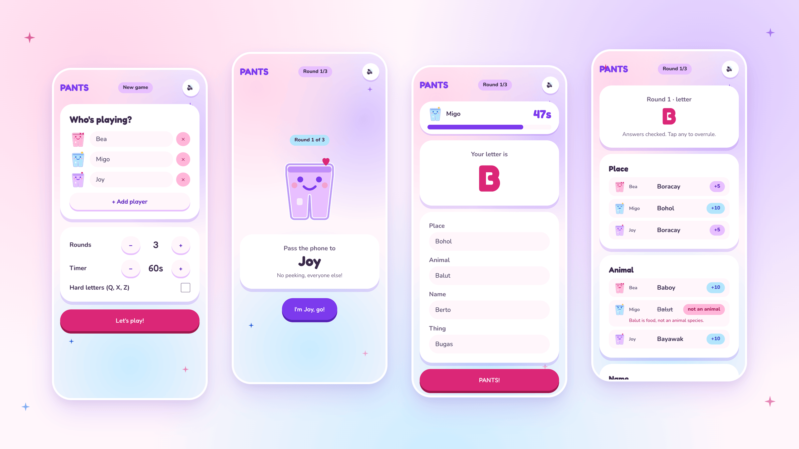
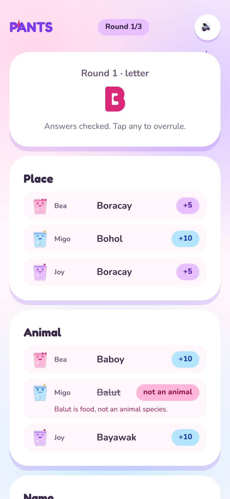
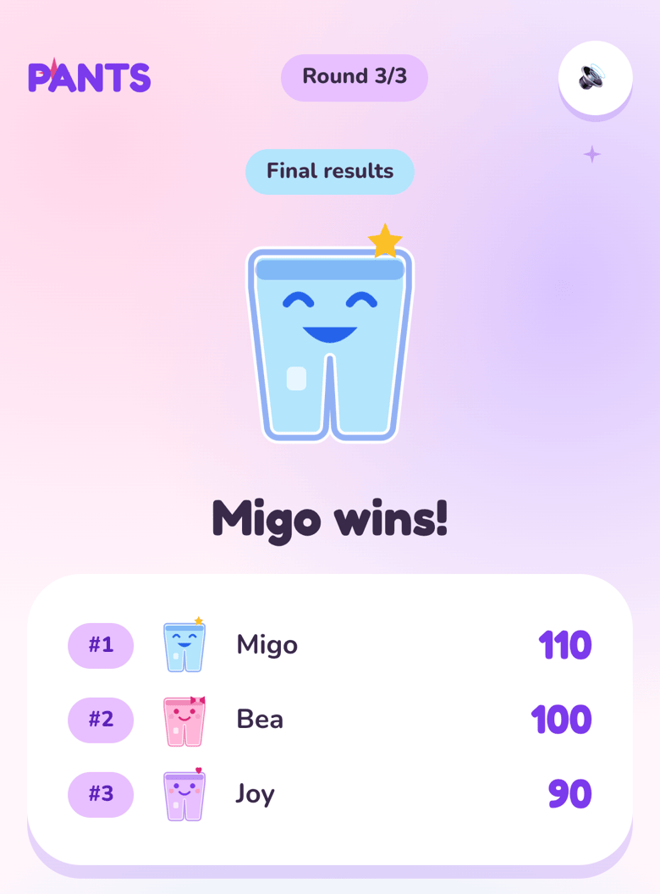

# PANTS

Place · Animal · Name · Thing · Score. The Filipino pen-and-paper game, on one phone that gets passed around.

**Play it on your phone: [pants-two.vercel.app](https://pants-two.vercel.app)**. No sign-up and no install.



## Play

- 2–8 players, 1–10 rounds, 20–90s per turn, optional hard letters (Q, X, Z).
- Each round shows one letter. Players take turns typing a Place, Animal, Name, and Thing that start with it.
- Reveal: 10 points for a unique answer, 5 if someone else wrote the same, 0 for blank, wrong letter, or an answer the referee rejects. Tap any answer to overrule the referee.
- A refresh mid-game resumes where you left off.

## AI referee

Arguing over whether "tigre" counts as an animal is half the game, so an LLM settles it first. At reveal, every answer that starts with the round's letter goes to `/api/validate` in one batch.

- The referee writes what each word means before it rules, then checks that meaning against the category, so an adjective cannot pass as a Thing and a person's name cannot pass as an Animal.
- It accepts English, Tagalog, Bisaya, other Philippine languages, Taglish, plurals, and obvious misspellings.
- Output is structured: the AI SDK returns one verdict per answer (`valid`, a short `meaning`, and a reason of at most 12 words), validated against a Zod schema. Verdicts for keys the server never sent are dropped.
- Models run through Vercel AI Gateway in fallback order: Claude Haiku 4.5, then Claude 3 Haiku. Override the list with `VALIDATION_MODELS`.
- Rejected answers score 0 and show the referee's reason. Players can tap any answer to overrule it, and if every model fails, the game falls back to manual rejection.

The starting letter is checked on the device, never by the model.

<p>
  
  &nbsp;
  
</p>

## Stack

Next.js 16 (App Router) · Tailwind 4 · Vercel AI SDK + AI Gateway · Zod · Supabase (anonymous auth, Postgres) · Vercel · Vitest.

## Develop

```bash
pnpm install
pnpm dev
pnpm test
pnpm lint && pnpm typecheck
```

The referee needs AI Gateway access. On Vercel it authenticates automatically; locally, put `AI_GATEWAY_API_KEY` in `.env.local` or run `vercel env pull`.

## Supabase (history + saved players)

The game works without Supabase. With it, finished matches, the player roster, and an anonymous answer bank are saved per device. Run `./scripts/supabase-setup.sh` once, then put the printed values in `.env.local` (see `.env.example`) and in the Vercel project's environment variables.

Schema lives in `supabase/migrations`. Push changes with `supabase db push`.
